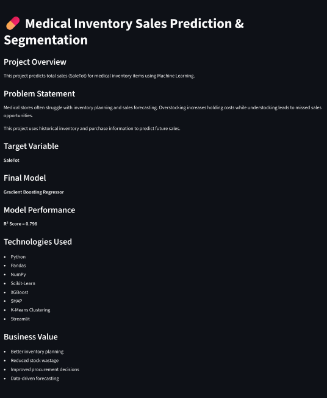

# 💊 Medical Inventory Forecasting & Decision Support System

An end-to-end Machine Learning and Decision Support System for forecasting medical inventory demand using real-world inventory and procurement data. The project combines predictive modeling, explainable AI, inventory segmentation, error analysis, and business decision-support workflows to support inventory planning and procurement decisions.

---

## 🚀 Live Demo

**🌐 Streamlit Application**

https://hemanthsai-medical-inventory-decision-support.streamlit.app/

**💻 GitHub Repository**

https://github.com/Hemanthsai456/Medical-Inventory-Forecasting-Decision-Support-System

---

## 📚 Documentation

This repository includes detailed technical and business documentation for deeper exploration.

| Document                      | Description                                                                                                  |
| ----------------------------- | ------------------------------------------------------------------------------------------------------------ |
| Technical Architecture Report | System architecture, ML pipeline, application design, and deployment overview                                |
| Error Analysis Report         | Residual analysis, demand-group evaluation, prediction error investigation, and model limitations            |
| Business Impact Report        | Business workflows, procurement recommendations, inventory planning strategy, and decision-support framework |
| Model Performance Report      | Model comparison, evaluation metrics, and final model selection rationale                                    |

---

## 📌 Project Overview

Medical inventory planning requires balancing product availability with inventory costs under uncertain demand conditions. This project addresses that challenge by combining machine learning forecasting with business decision-support techniques.

The application predicts future inventory demand using historical inventory and procurement data, explains model behavior through SHAP Explainable AI, evaluates forecasting reliability using detailed error analysis, segments inventory using K-Means clustering, and generates inventory planning recommendations through an interactive Streamlit application.

The final system extends beyond prediction by transforming machine learning outputs into actionable inventory planning insights.

<p align="center">
  
</p>

---

## 🎯 Business Problem

Medical inventory managers frequently face operational challenges such as:

* Demand uncertainty
* Overstocking and excess carrying costs
* Stockout risk
* Manual forecasting limitations
* Procurement planning inefficiencies
* Limited visibility into inventory behavior

The objective of this project is to improve inventory planning by combining demand forecasting, explainability, inventory segmentation, and business recommendations within a unified decision-support system.

---

## ⭐ Key Features

* End-to-End Machine Learning Pipeline
* Interactive Analytics Dashboard
* 14 Machine Learning & Ensemble Model Comparisons
* Hyperparameter Tuning & Model Selection
* Gradient Boosting Regressor Deployment
* SHAP Explainable AI
* Feature Importance Analysis
* Error Analysis & Model Diagnostics
* Demand Group Performance Analysis
* Residual Analysis & Prediction Error Investigation
* Demand Classification Framework
* Inventory Risk Assessment
* Procurement Recommendation Engine
* Inventory Turnover Analysis
* Business Impact Simulation
* K-Means Inventory Segmentation
* Multi-Page Streamlit Application
* Technical & Business Documentation
* Streamlit Cloud Deployment

---

## ⚙️ Technology Stack

| Category         | Technologies                |
| ---------------- | --------------------------- |
| Programming      | Python                      |
| Data Processing  | Pandas, NumPy               |
| Machine Learning | Scikit-Learn, XGBoost       |
| Explainable AI   | SHAP                        |
| Visualization    | Plotly, Matplotlib, Seaborn |
| Web Application  | Streamlit                   |
| Version Control  | Git, GitHub                 |
| Deployment       | Streamlit Community Cloud   |

---


## 🔄 End-to-End Workflow

```text
Medical Inventory Data
          ↓
Data Cleaning & Validation
          ↓
Exploratory Data Analysis
          ↓
Feature Engineering
          ↓
Machine Learning Model Development
          ↓
Hyperparameter Tuning & Model Selection
          ↓
Model Evaluation & Error Analysis
          ↓
SHAP Explainability
          ↓
Inventory Segmentation (K-Means)
          ↓
Business Decision Support
          ↓
Interactive Streamlit Deployment
```

---

## 📊 Exploratory Data Analysis

Exploratory Data Analysis (EDA) was performed to understand inventory behavior, identify demand patterns, evaluate supplier performance, and uncover opportunities for inventory optimization.

### Key Analyses

* Fast-Moving Product Identification
* Purchase vs Sales Analysis
* Stock vs Sales Analysis
* High Inventory Exposure Analysis
* Overstock Detection
* Company-Level Sales Analysis
* Inventory Turnover Analysis

### Business Outcomes

* Identified replenishment priorities
* Detected slow-moving and overstocked inventory
* Analyzed supplier performance
* Improved visibility into inventory utilization
* Generated operational insights for inventory planning

<p align="center">
  
</p>

---

## 📈 Interactive Analytics Dashboard

The static EDA was transformed into an interactive Streamlit dashboard using Plotly to enable dynamic inventory exploration and executive decision-making.

### Dashboard Capabilities

* Executive KPI Monitoring
* Interactive Plotly Visualizations
* Dynamic Filtering
* Company & Product-Level Analysis
* Inventory Exposure Monitoring
* Executive Business Insights

### Business Value

The dashboard enables inventory managers to monitor inventory performance, analyze demand trends, identify operational risks, and support procurement planning through interactive analytics.

---

## 🤖 Machine Learning Pipeline

A comprehensive model selection process was performed to identify the most suitable forecasting model for medical inventory demand.

### Models Evaluated

#### Tree-Based Models

* Random Forest Regressor
* Gradient Boosting Regressor
* XGBoost Regressor

#### Voting Ensembles

* Voting [1,1,1]
* Voting [1,3,2]
* Voting [1,4,2]
* Voting [1,5,3]
* Voting [2,5,3]

#### Stacking Ensembles

* Stacking Linear Regression
* Stacking Ridge
* Stacking Lasso
* Stacking Random Forest
* Stacking Gradient Boosting
* Stacking XGBoost

A total of **14 machine learning and ensemble models** were trained, tuned, and evaluated using R² Score, RMSE, and MAE. The final production model was selected based on predictive performance, generalization capability, and forecasting stability.

---

## 🏆 Final Model Performance

After evaluating 14 machine learning and ensemble models, the **Gradient Boosting Regressor** was selected as the final production model.

### Performance Metrics

| Metric       |      Value |
| ------------ | ---------: |
| **R² Score** | **0.7978** |
| **RMSE**     |  **9.692** |
| **MAE**      |  **4.415** |

### Why Gradient Boosting?

The final model consistently achieved the best overall performance across all evaluation metrics while demonstrating stable generalization on unseen data.

Key reasons for selection:

* Highest R² Score
* Lowest RMSE
* Lowest MAE
* Robust generalization performance
* Stable forecasting across inventory categories

---

## 📉 Error Analysis & Model Diagnostics

Model evaluation extended beyond traditional performance metrics to understand **where and why forecasting errors occur**.

### Analysis Performed

* Demand Group Performance Analysis
* Actual vs Predicted Evaluation
* Residual Distribution Analysis
* Residual Scatter Analysis
* Top 20 Prediction Error Investigation

### Key Findings

* Strong forecasting performance for low and medium demand products.
* Prediction error increases during high-demand scenarios.
* Most large errors occur during rare inventory situations rather than systematic model failures.
* Residual analysis indicates generally stable model behavior across the majority of observations.

📄 **Detailed analysis is available in:**
`documentation/Error_Analysis_Report.md`

---

## 🧠 Explainable AI (SHAP)

To improve model transparency, SHAP (SHapley Additive exPlanations) was implemented to explain both global model behavior and individual predictions.

### Implemented Components

* SHAP Summary Plot
* SHAP Waterfall Plot
* Global Feature Importance
* Local Prediction Explanation

### Key Insights

The most influential variables were:

1. Opening Stock (OStk)
2. Purchase Quantity (PurTot)
3. Inventory Value (QohValue)
4. Packing
5. Product Type Features

These insights help explain why predictions are generated and improve stakeholder confidence in model outputs.

📄 **Additional implementation details are available in:**
`documentation/Technical_Architecture.md`

---

## 📦 Inventory Segmentation

K-Means clustering was applied to group products with similar inventory and sales characteristics, enabling more targeted inventory management strategies.

### Cluster Categories

* Low-Demand Products
* Fast-Moving Products
* High-Value Products
* Bulk & Moderate-Demand Products

### Business Applications

* Inventory prioritization
* Replenishment planning
* Inventory exposure monitoring
* Resource allocation
* Segment-based inventory strategies

Rather than relying solely on demand forecasts, the segmentation layer provides additional operational context for inventory planning and decision-making.

---

## Inventory Segmentation page

<p align="center">
  
</p>

<p align="center">
  
</p>

<p align="center">
  
</p>

---

## 🚀 Streamlit Application

The project is deployed as a multi-page Streamlit application that integrates analytics, forecasting, explainability, inventory segmentation, and decision-support workflows into a unified interface.

### Application Modules

| Module                           | Purpose                                           |
| -------------------------------- | ------------------------------------------------- |
| 🏠 Home                          | Project overview and business context             |
| 📊 EDA Dashboard                 | Interactive analytics and KPI monitoring          |
| 🔮 Prediction & Decision Support | Sales forecasting and procurement recommendations |
| 🤖 Model Comparison              | Performance comparison across 14 ML models        |
| 🧠 Explainable AI                | SHAP-based model interpretation                   |
| 📦 Inventory Segmentation        | Cluster profiling and inventory strategy          |
| 📉 Error Analysis                | Model diagnostics and forecasting reliability     |
| ℹ️ About                         | Project overview, workflow, and technologies      |

---

## 🔮 Prediction & Decision Support

The prediction engine extends beyond forecasting by converting machine learning outputs into operational recommendations.

<p align="center">
  
</p>

### Prediction Pipeline

```text
Inventory Inputs
        ↓
Sales Forecast
        ↓
Demand Classification
        ↓
Inventory Risk Assessment
        ↓
Procurement Recommendation
        ↓
Inventory Planning Decision
```

### Decision Support Features

* Sales Forecasting
* Demand Classification
* Inventory Risk Assessment
* Procurement Recommendation Engine
* Inventory Turnover Analysis
* Procurement Decision Simulation
* Business Impact Assessment

The application transforms predictive analytics into actionable inventory planning recommendations, enabling users to move from forecasts to operational decisions.

📄 **Business workflows and decision-support framework are documented in:**
`documentation/Business_Impact_Report.md`

---

## 📂 Repository Structure

```text
Medical-Inventory-Forecasting-Decision-Support-System/

├── app.py
├── pages/
├── models/
├── notebooks/
├── utils/
├── images/
├── documentation/
│   ├── Technical_Architecture.md
│   ├── Business_Impact_Report.md
│   ├── Model_Performance_Report.md
│   ├── Error_Analysis_Report.md
│   └── error_analysis/
├── requirements.txt
├── LICENSE
└── README.md
```

---

## 🚀 Installation

### Clone the Repository

```bash
git clone https://github.com/Hemanthsai456/Medical-Inventory-Forecasting-Decision-Support-System.git
cd Medical-Inventory-Forecasting-Decision-Support-System
```

### Create a Virtual Environment

**Windows**

```bash
python -m venv venv
venv\Scripts\activate
```

**Linux / macOS**

```bash
python3 -m venv venv
source venv/bin/activate
```

### Install Dependencies

```bash
pip install -r requirements.txt
```

### Launch the Application

```bash
streamlit run app.py
```

---

## 📖 Reproducing the Project

The complete development workflow can be reproduced by executing:

```text
notebooks/
└── Medical_Inventory.ipynb
```

The notebook includes:

* Data preprocessing
* Exploratory Data Analysis
* Feature engineering
* Model development
* Hyperparameter tuning
* Model evaluation
* Explainability
* Inventory segmentation

---

## 🔒 Data Privacy

This project uses real-world medical inventory data.

To maintain business confidentiality, the original dataset is not included in this repository. All published notebooks, trained models, dashboards, and visualizations have been prepared without exposing sensitive operational information.

---

## ⭐ Project Highlights

* End-to-End Machine Learning Pipeline
* Real-World Medical Inventory Forecasting Use Case
* 14 Machine Learning & Ensemble Model Comparisons
* Hyperparameter Tuning & Model Selection
* Gradient Boosting Regressor Deployment
* SHAP Explainable AI
* Feature Importance Analysis
* Error Analysis & Model Diagnostics
* Demand Group Performance Analysis
* Residual Analysis & Prediction Error Investigation
* Demand Classification Framework
* Inventory Risk Assessment
* Procurement Recommendation Engine
* Inventory Turnover Analysis
* Business Impact Simulation
* Model-Assisted Decision Support Workflow
* K-Means Inventory Segmentation
* Interactive Analytics Dashboard
* Multi-Page Streamlit Application
* Technical & Business Documentation
* Streamlit Cloud Deployment

---

## 🔮 Future Enhancements

Future work may focus on expanding forecasting capability rather than increasing application complexity.

Potential enhancements include:

* Demand Spike Detection
* Seasonal Demand Forecasting
* Inventory Optimization Algorithms
* Forecast Drift Monitoring
* Automated Inventory Policy Recommendations

---

## 👨‍💻 Author

**Charagundla Hemanth Sai**

Artificial Intelligence & Data Science

📧 **Email:** [hemanthsai.ch456@gmail.com](mailto:hemanthsai.ch456@gmail.com)

🔗 **LinkedIn:**
https://www.linkedin.com/in/hemanth-sai-charagundla-4a8659376/

💻 **GitHub:**
https://github.com/Hemanthsai456

---

## ⭐ If you found this project useful

If you found this repository interesting or helpful, consider giving it a ⭐ on GitHub.
